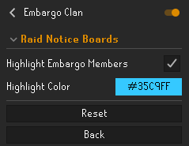
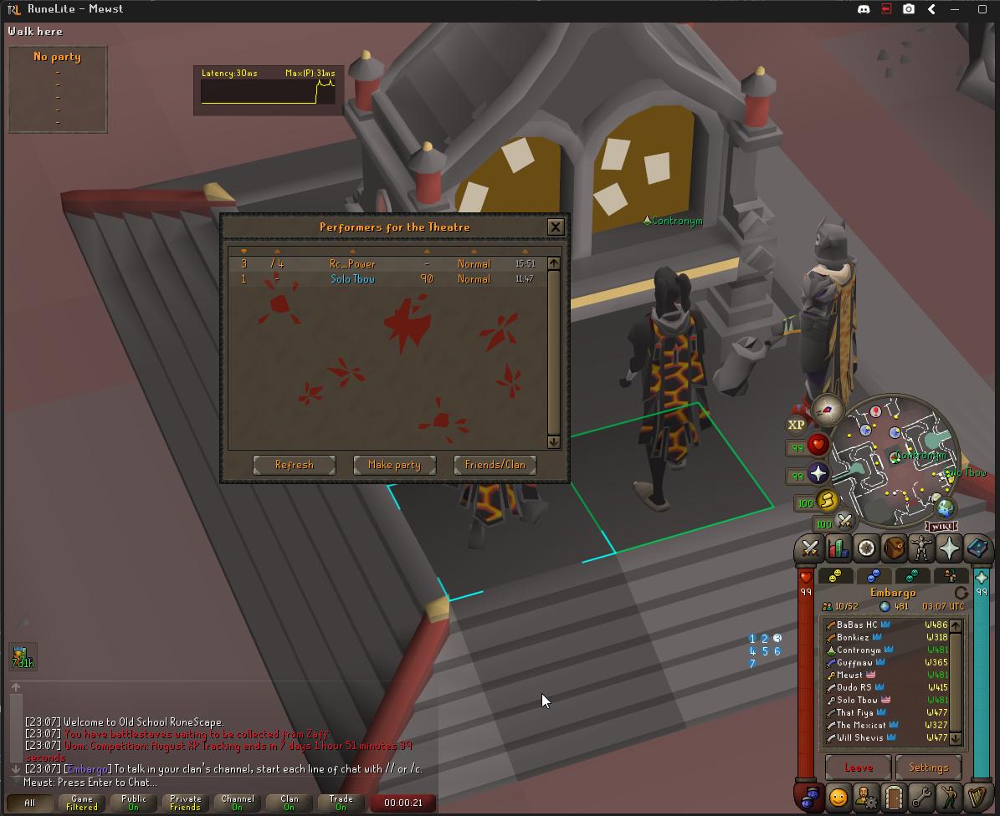
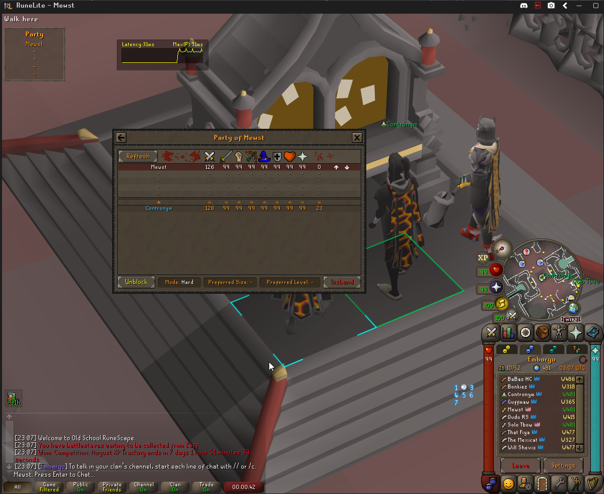
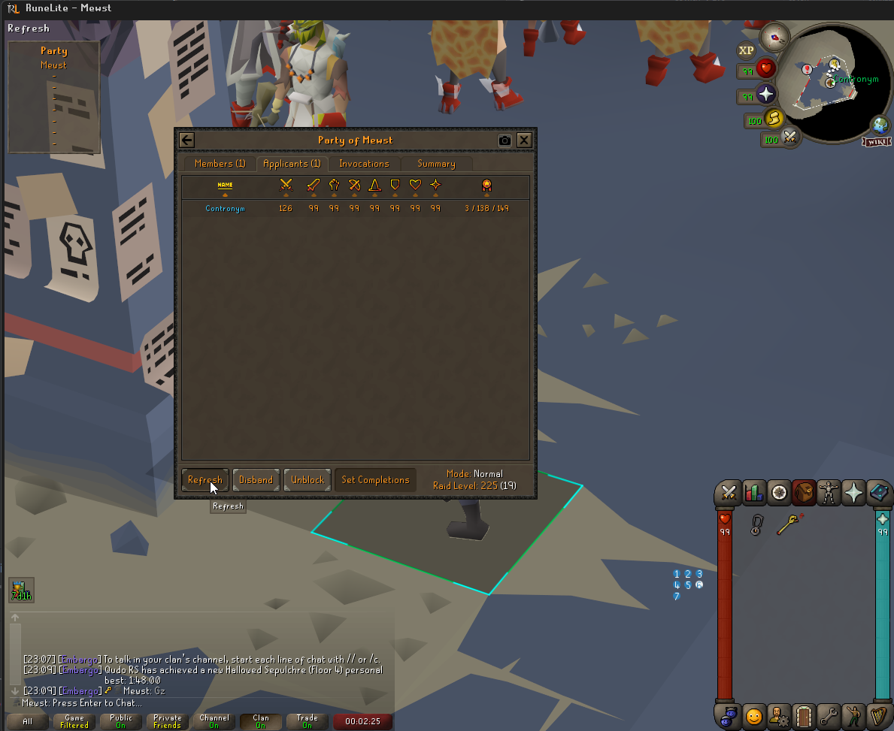

# Embargo Plugin
A plugin to track Embargo clan member's accomplishments

## IP warning
The IP warning is required by RuneLite since the plugin sends the data to Embargo's servers. We do not store your IP address or do anything with it.

## Data Embargo collects

The plugin currently sends the following to Embargo's servers:
* Quest points
* All skill levels
* Account type (Ironman, Ultimate, Group..)
* Diary achievement completion status (easy, medium, hard, elite..)
* Combat achievement completion status (easy, medium, hard, master, grandmaster..)
* Tracks loot of raids you complete
* Minigame completions (Wintertodt, tempoross, gotr, soul wars, barbarian assault, volcanic mine)
* Items that aren't on the collection log. The current items we look for in your bank are:
    * Book of the dead
    * Music cape/music cape (t)
    * Barrows gloves
    * Imbued god capes (sara, guthix, zamorak (max/imbued max capes included))
 

## Other features
### Clan member raid board highlighting: 

Config settings:

TOB:

TOA:

